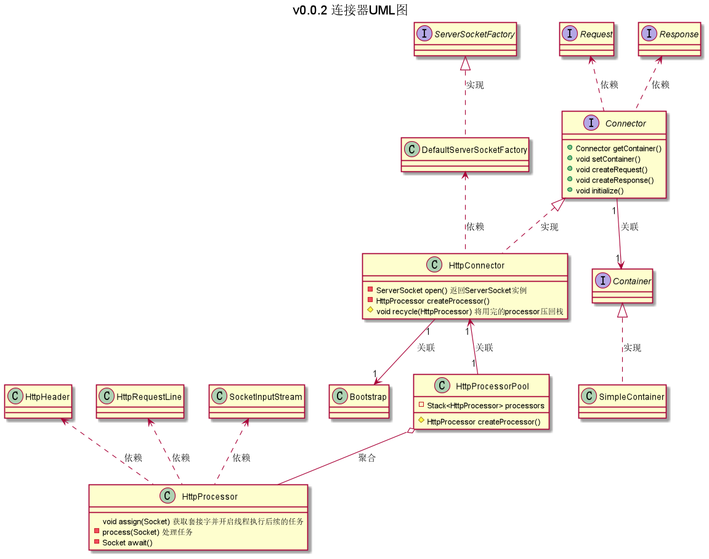
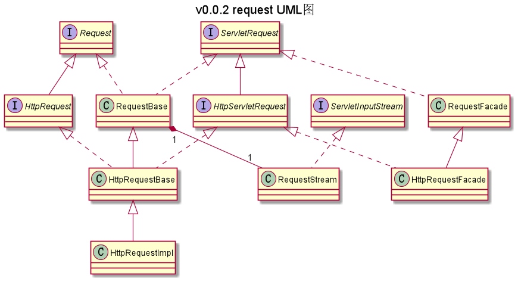
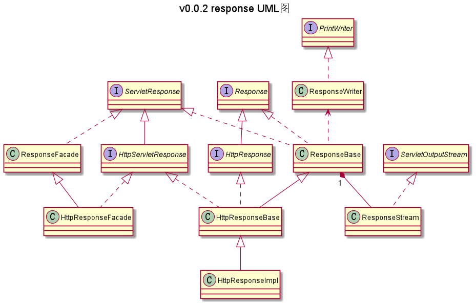

一个仿制Tomcat的HTTP服务器  
---
---

### 目录结构
|包|作用|
|----|----|
|com.ranni.util|此目录为工具模块|
|com.ranni.processor|此目录为核心模块|
|com.ranni.connector|此目录为连接器模块|  
|com.ranni.startup|此目录为HTTP服务器启动模块|  

#
### 版本说明：0.0.2
**UML类图：**

**更新：**
- 新增HttpProcessorPool
- 采用异步处理Http请求
- 更新Request类关系
- 更新Response类关系
- 采用单例模式获取ServerSocket对象  
  
**已知问题：**
- CookieTools和DateTool为Tomcat源码文件  

# 
### 版本说明：0.0.1
**更新：**
- 实现简单的启动器模块
- 实现简单的连接器模块
- 实现简单的核心模块

**已知问题：**
- 服务器本身为单线程工作
- 会收到客户端发来的空包（目前做丢弃处理）
- 未实现指定字符编码
- CookieTools和DateTool为Tomcat源码文件
- 被加载的类文件不能有package（即不能把自己打包）
- 对获取静态文件的支持不够完整