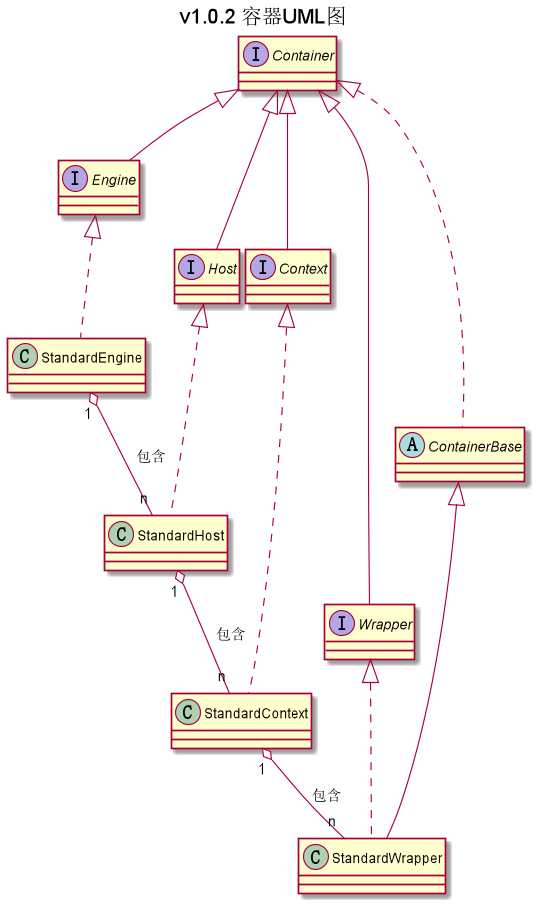

## com.ranni.container包下类/接口的说明

+ [context](./context/README.md)
+ [wrapper](./wrapper/README.md)
+ [pip](./pip/README.md)
+ [loader](./loader/README.md)

|类型|类名|说明|
|---|---|---|
|接口|Container|所有容器的根接口|
|接口|Engine|服务器引擎容器|
|接口|Host|包含一个或多个Context容器的虚拟机主机|
|接口|Context|一个Web应用程序。一个Context可以包含多个Wrapper|
|接口|Wrapper|表示一个独立的对servlet进行增强的容器，其中包含了对servlet的调用执行|
|接口|Mapper|映射器，关联URL中请求的容器名与实际的wrapper容器名|
|接口|DefaultContext|默认Context容器实现类| 
|抽象类|ContainerBase|基本容器抽象类，由StandardWrapper继承|
|实现类|StandardDefaultContext|DefaultContext接口的标准实现类，***暂时没有用到***|

注：  
- 实现类：指对抽象方法（接口、抽象类）的实现
- 继承类：继承父类后增加一些属于自己的方法、属性
- 包装类：根据其设计意义指继承了实现类后对父类方法进行增强以便于其他类使用的类的统称
- 外观类：根据其设计意义指实现类对外开放访问，从而隐藏实现类具体实现的类的统称
  
### 精简版UML类图

