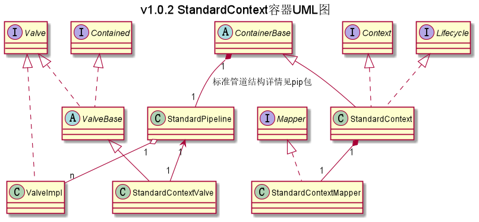

## com.ranni.container.context包下类/接口的说明

|类型|类名|说明|
|---|---|---|
|实现类|SimpleContextValve|所有容器的根接口|
|实现类|StandardContext|所有容器的根接口|
|实现类|StandardContextMapper|所有容器的根接口|
|实现类|StandardValveContext|所有容器的根接口|
  
   
注：  
- 实现类：指对抽象方法（接口、抽象类）的实现
- 继承类：继承父类后增加一些属于自己的方法、属性
- 包装类：根据其设计意义指继承了实现类后对父类方法进行增强以便于其他类使用的类的统称
- 外观类：根据其设计意义指实现类对外开放访问，从而隐藏实现类具体实现的类的统称

### UML类图
