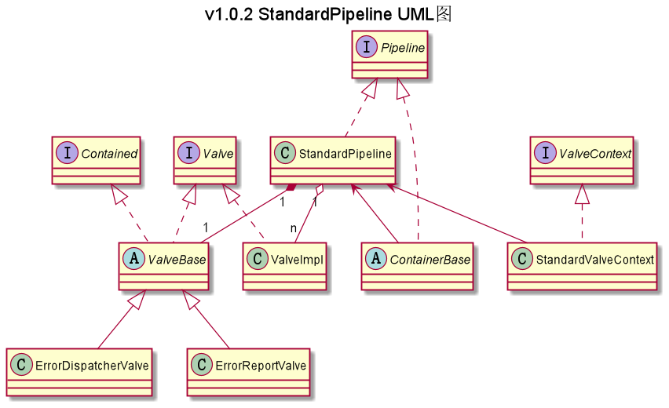

## com.ranni.container.pip包下类/接口的说明

此包下存放的是管道和阀机制的接口和该机制通用的实现类 

---

|类型|类名|说明|
|---|---|---|
|接口|Contained|此接口是关联阀与容器关联的接口，阀可以选择性实现此接口|
|接口|Pipeline|管道，定义管道应该进行的一些行为|
|接口|Valve|阀，定义阀应该进行的一些行为|
|接口|ValveContext|阀容器接口，提供一个invokeNext()方法自动往下执行阀，由管道对象（StandardPipeline）调用|
|实现类|StandardPipeline|标准管道，管道中装有阀，从外面看阀就是通过管道依次执行|
|实现类|StandardValveContext|阀容器，主要就是把基础阀和其它阀包装到了此类中，从内部看，管道调用了此类的invokeNext()方法依次执行阀|
|抽象类|ValveBase|基础阀抽象类，此抽象类实现Valve和Contained接口，基础阀必须继承这个抽象类|

注：  
- 实现类：指对抽象方法（接口、抽象类）的实现
- 继承类：继承父类后增加一些属于自己的方法、属性
- 包装类：根据其设计意义指继承了实现类后对父类方法进行增强以便于其他类使用的类的统称
- 外观类：根据其设计意义指实现类对外开放访问，从而隐藏实现类具体实现的类的统称

### UML类图

