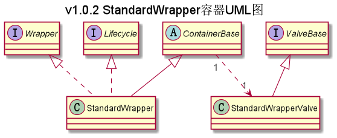

## com.ranni.container.wrapper包下类/接口的说明

此包下存放的是Wrapper容器的标准实现类（StandardWrapper）以及Wrapper标准实现类
会用到的一些组件的实现类
---

|类型|类名|说明|
|---|---|---|
|实现类|StandardWrapper|标准的Wrapper容器，一个Wrapper对应着一个Servlet，Wrapper可以通过管道阀机制增强Servlet|
|实现类|StandardWrapperValve|Wrapper容器中的标准基础阀，最终会解析请求的Servlet类文件，创建Servlet对象并执行该对象的service()方法|

   
注：  
- 实现类：指对抽象方法（接口、抽象类）的实现
- 继承类：继承父类后增加一些属于自己的方法、属性
- 包装类：根据其设计意义指继承了实现类后对父类方法进行增强以便于其他类使用的类的统称
- 外观类：根据其设计意义指实现类对外开放访问，从而隐藏实现类具体实现的类的统称

### UML类图

注：这张UML图省略了ContainerBase和StandardPipeline的关联部分，
所以从表面上看ContainerBase就像是依赖StandardWrapperValve