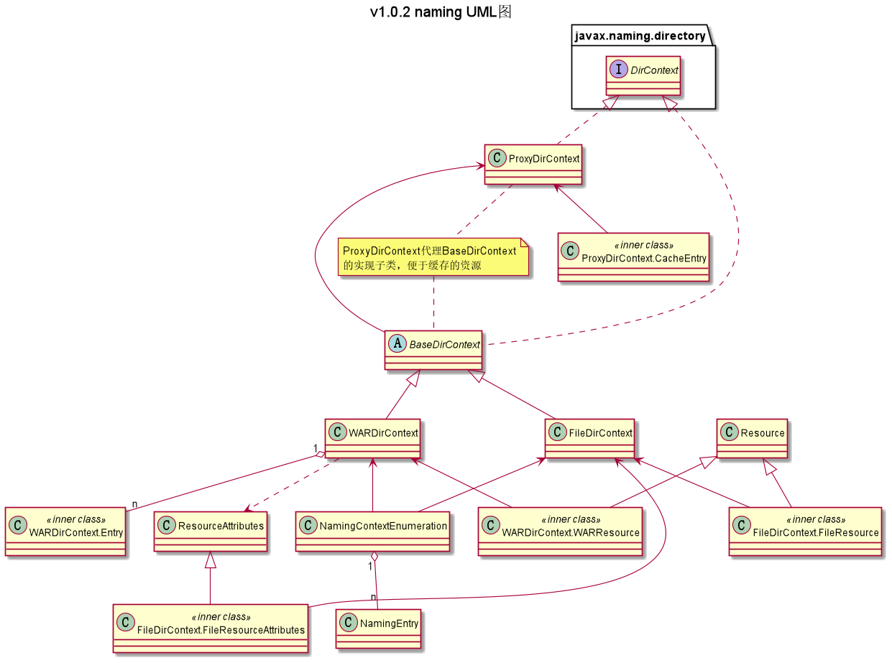

## com.ranni.naming包下类/接口的说明

此包存放了JNDI的实现，其中BaseDirContext、ProxyDirContext、FileDirContext、
WARDirContext是重中之重  
**标记了Deprecated的类暂时不做说明，因为后续有可能移除**
---

|类型|类名|说明|
|---|---|---|
|抽象类|BaseDirContext|实现DirContext的抽象类，将相同用途的重载方法进行合并调用，便于实现类的实现|
|实现类|ProxyDirContext|DirContext实现子类的代理类，主要是对解析的文件进行缓存提高使用效率|
|实现类|FileDirContext|物理存储中文件目录在JNDI中的容器实体，是BaseDirContext的子类|
|实现类|WARDirContext|物理存储中WAR包在JNDI中的容器实体，是BaseDirContext的子类。WARDirContext是个标准的树型结构，子节点由内部类Entry来实现，Entry中存有ZipEntry属性。WAR中资源的属性没有用单独的内部类去实现，在获取属性时直接创建初始化Resource对象返回|
|实现类|NamingContextEnumeration|JNDI容器的迭代器对象，遍历返回的是JNDI命名和类绑定的对象|
|视图类|NamingEntry|一个JNDI视图对象，将JNDI命名和实际的资源对象关联起来|
|实现类|Resource|资源文件对象，主要就两个属性，输入流和文件内容的字节数组。提供输入流和字节数组的访问|
|实现类|ResourceAttributes|资源属性，存放资源的一些属性，例如windows下右键资源然后有个属性选项，点开就能看到的那些属性。这个类存放的就是那些东西（再具体点就是，名称、创建时间、修改时间、资源大小等）|
|继承类、内部类|FileDirContext.FileResource|Resource的子类。若FileDirContext所代表的文件目录下有个文件，需要得到这个文件的内容，那么就会把这个File对象包装为FileResource对象，相比Resource仅仅多了File对象绑定|
|继承类、内部类|FileDirContext.FileResourceAttributes|ResourceAttributes的子类。增加访问标志位，增加File对象的绑定|
|继承类、内部类|WARDirContext.WARResource|Resource的子类。相较于父类，添加对文件的绑定，需要实现的功能和FileDirContext.FileResource一致|
|实现类、内部类|WARDirContext.Entry|Comparable的实现类。实现比较器方法，是WAR包的树型结构中节点的包装|
  
  
注：  
- 普通类：emm，就是普通类
- 实现类：指对抽象方法（接口、抽象类）的实现
- 继承类：继承父类后增加一些属于自己的方法、属性
- 包装类：根据其设计意义指继承了实现类后对父类方法进行增强以便于其他类使用的类的统称
- 外观类：根据其设计意义指实现类对外开放访问，从而隐藏实现类具体实现的类的统称
- 视图类：是集合的一部分（集合中的元素），同时也是一些属性的集合

### UML类图

